## Overview

Maneged follows a modern client-server architecture with real-time capabilities powered by WebSocket connections. The system is designed for scalability, reliability, and real-time collaboration.

## High-Level Architecture

```mermaid
graph TB
    subgraph Client["📱 Client Layer"]
        User1[Flutter Mobile<br/>User 1]
        User2[Flutter Mobile<br/>User 2]
        User3[Flutter Mobile<br/>User 3]
    end
    
    subgraph Gateway["🌐 API Gateway Layer"]
        subgraph Backend["Backend Server"]
            REST[REST API<br/>Endpoints]
            WS[WebSocket Server<br/>Real-time]
        end
    end
    
    subgraph Services["☁️ Services Layer"]
        Appwrite[Appwrite Backend<br/>• Database<br/>• Auth<br/>• Storage]
        Firebase[Firebase<br/>• FCM<br/>• Analytics]
    end
    
    User1 -->|REST + WebSocket| Backend
    User2 -->|REST + WebSocket| Backend
    User3 -->|REST + WebSocket| Backend
    
    Backend --> Appwrite
    Backend --> Firebase
    
    style Client fill:#E8F5E9
    style Gateway fill:#E3F2FD
    style Services fill:#FFF3E0
    style Backend fill:#BBDEFB
```



## System Components

### 1. Mobile Client (Flutter)

**Technology Stack:**
- Flutter 3.16+
- Dart 3.2+
- Provider for state management
- Isar for local database

**Responsibilities:**
- User interface and interaction
- Local data caching with Isar
- WebSocket connection management
- Offline-first data sync
- Push notification handling

**Key Features:**
- Offline support with automatic sync
- Real-time UI updates
- Message queueing for offline messages
- Connection health monitoring

### 2. Backend Server (Node.js)

**Technology Stack:**
- Node.js (ES Modules)
- Express.js 5.x
- WebSocket (ws library)
- Appwrite SDK

**Responsibilities:**
- REST API endpoints
- WebSocket server for real-time features
- Authentication and authorization
- Business logic and validation
- Push notification delivery via FCM

**Architecture Pattern:**
- MVC (Model-View-Controller)
- Middleware-based request processing
- Service layer for business logic

### 3. Database Layer (Appwrite)

**Collections:**
- `users` - User profiles and settings
- `organizations` - Company/team data
- `conversations` - Chat rooms
- `messages` - Chat messages
- `message_reactions` - Emoji reactions
- `tasks` - Task management
- `schedules` - Calendar events
- `notifications` - User notifications

**Features:**
- Real-time subscriptions
- Relationships and indexes
- Role-based access control
- File storage with CDN

### 4. Push Notifications (Firebase)

**Services:**
- Firebase Cloud Messaging (FCM)
- Firebase Analytics
- Crash Reporting

**Notification Types:**
- New messages
- Mentions
- Task assignments
- Schedule reminders
- System notifications

## Data Flow

### Message Sending Flow

```mermaid
graph TB
    A[1️⃣ User sends message<br/>via Flutter app]
    B[2️⃣ Message sent via WebSocket<br/>to backend]
    C[3️⃣ Backend validates and<br/>saves to Appwrite]
    D[4️⃣ Backend broadcasts via<br/>WebSocket to online users]
    E[5️⃣ Backend sends FCM push<br/>to offline users]
    F[6️⃣ Recipient clients receive<br/>and display message]
    
    A --> B --> C --> D --> E --> F
    
    style A fill:#4CAF50
    style B fill:#2196F3
    style C fill:#FF9800
    style D fill:#9C27B0
    style E fill:#FFC107
    style F fill:#4CAF50
```



### Real-time Synchronization


## Communication Patterns

### REST API

Used for:
- User authentication
- Profile management
- Data querying and pagination
- File uploads
- Organization management

**Endpoints:**
- `GET /v1/user/profile` - Get user data
- `POST /v1/messages/send` - Send message
- `GET /v1/conversations/` - List conversations
- `POST /v1/tasks/create` - Create task

### WebSocket

Used for:
- Real-time messaging
- Typing indicators
- Presence system (online/offline status)
- Live notifications
- Message delivery confirmations

**Events:**
- `MESSAGE` - New message received
- `SENT` - Message sent confirmation
- `DELIVERED` - Message delivered to recipients
- `READED` - Message read by recipient
- `USER_STATUS` - User online/offline status
- `TYPING` - Typing indicator

## Security Architecture

### Authentication Flow

```mermaid
sequenceDiagram
    participant User as 👤 User
    participant Client as Flutter App
    participant Backend as Backend Server
    participant Appwrite as Appwrite Auth
    
    User->>Client: Login (email/password)
    Client->>Appwrite: Validate credentials
    Appwrite->>Appwrite: Check credentials
    Appwrite-->>Client: JWT Token
    Client->>Client: Store token securely
    
    Note over Client: For all subsequent requests
    
    Client->>Backend: API Request + Token
    Backend->>Appwrite: Validate token
    Appwrite-->>Backend: User info
    Backend-->>Client: Response
```



### Authorization Layers

1. **User Authentication** - JWT token validation
2. **API Scopes** - Fine-grained permissions for API keys
3. **Resource Ownership** - Users can only access their data
4. **Organization Isolation** - Data segregation by organization

### API Scope System

```javascript
{
  "read:users": "Read user profiles",
  "write:users": "Create/update users",
  "read:messages": "Read messages",
  "write:messages": "Send messages",
  "read:tasks": "Read tasks",
  "write:tasks": "Create/update tasks",
  "generate:api": "Generate API keys",
  "manage:api": "Manage API keys",
  "admin:all": "Full admin access"
}
```

## Scalability Considerations

### Horizontal Scaling

- **Backend**: Stateless design allows multiple instances
- **WebSocket**: Use sticky sessions or Redis pub/sub
- **Database**: Appwrite handles scaling automatically

### Performance Optimizations

1. **Caching**:
   - Local caching with Isar (mobile)
   - Memory caching for frequently accessed data
   - CDN for static assets

2. **Database Indexing**:
   - Compound indexes on frequently queried fields
   - Optimized queries with proper filtering

3. **Connection Management**:
   - WebSocket connection pooling
   - Automatic reconnection with exponential backoff
   - Heartbeat mechanism (ping/pong)

4. **Message Delivery**:
   - Batch processing for bulk operations
   - Queue system for offline message delivery
   - Efficient push notification batching

## Offline Support

### Mobile App Strategy

1. **Local-First Architecture**:
   - All data stored locally in Isar
   - UI reads from local database
   - Background sync to server

2. **Sync Mechanism**:
   - Optimistic updates
   - Conflict resolution
   - Delta sync for efficiency

3. **Queue Management**:
   - Pending message queue
   - Auto-retry with backoff
   - Status indicators for users

## Monitoring & Observability

### Key Metrics

- **Backend**:
  - API response times
  - WebSocket connection count
  - Message throughput
  - Error rates

- **Mobile**:
  - App crashes
  - Network errors
  - Sync performance
  - Battery usage

### Logging Strategy

- Structured logging with timestamps
- Error tracking with stack traces
- Performance monitoring
- User activity analytics

## Deployment Architecture

### Development Environment


### Production Environment


## Future Enhancements

<AccordionGroup>
  <Accordion title="Planned Features">
    - Video/voice calling with WebRTC
    - End-to-end encryption
    - Advanced analytics dashboard
    - Third-party integrations (Slack, Jira, etc.)
    - Desktop applications (Windows, macOS, Linux)
  </Accordion>

  <Accordion title="Scalability Improvements">
    - Redis for distributed caching
    - Message queue system (RabbitMQ/Kafka)
    - Microservices architecture
    - Database sharding
    - Edge computing with CDN
  </Accordion>
</AccordionGroup>

## Next Steps

<CardGroup cols={2}>
  <Card
    title="Backend Setup"
    icon="server"
    href="/backend/installation"
  >
    Set up the backend server
  </Card>
  <Card
    title="Mobile Architecture"
    icon="mobile"
    href="/mobile/architecture"
  >
    Explore mobile app architecture
  </Card>
  <Card
    title="WebSocket API"
    icon="bolt"
    href="/backend/websocket"
  >
    Learn about real-time features
  </Card>
  <Card
    title="Security"
    icon="lock"
    href="/backend/authentication"
  >
    Understand security model
  </Card>
</CardGroup>
