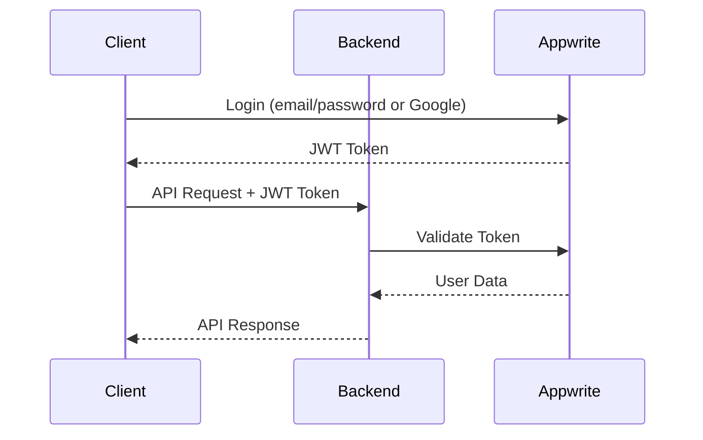

## Overview

Maneged supports multiple authentication methods to provide flexibility and security for different use cases. The system uses JWT tokens for user authentication and supports API keys with fine-grained scopes for programmatic access.

## Authentication Methods

<CardGroup cols={2}>
  <Card title="User Tokens" icon="user">
    JWT tokens issued by Appwrite for user authentication
  </Card>
  <Card title="API Keys" icon="key">
    Scoped API keys for programmatic access with limited permissions
  </Card>
</CardGroup>

## User Authentication

### Authentication Flow



### Login Methods

#### Email/Password Authentication

```javascript
// Client-side (Flutter)
final account = Account(client);
final session = await account.createEmailSession(
  email: 'user@example.com',
  password: 'securePassword123'
);

// Extract JWT token
final jwt = session.secret;
```

#### Google OAuth

```javascript
// Client-side (Flutter)
final session = await account.createOAuth2Session(
  provider: 'google'
);
```

### Using JWT Tokens

Include the JWT token in the `x-api-key` header with `Bearer` prefix:

```bash
curl -H "x-api-key: Bearer eyJhbGciOiJIUzI1NiIsInR5cCI6IkpXVCJ9..." \
     https://api.maneged.com/v1/user/profile
```

## API Key System

### Available Scopes

API keys can be assigned specific scopes to limit their permissions:

<Tabs>
  <Tab title="User Scopes">
    - `read:users` - Read user profiles and information
    - `write:users` - Create, update, and modify user data
  </Tab>
  <Tab title="Organization Scopes">
    - `read:organizations` - Read organization information
    - `write:organizations` - Create and modify organizations
  </Tab>
  <Tab title="Message Scopes">
    - `read:messages` - Read messages
    - `write:messages` - Send and modify messages
  </Tab>
  <Tab title="Conversation Scopes">
    - `read:conversations` - Read conversation data
    - `write:conversations` - Create and manage conversations
  </Tab>
  <Tab title="Task Scopes">
    - `read:tasks` - Read tasks and task information
    - `write:tasks` - Create, update, and manage tasks
  </Tab>
  <Tab title="API Management">
    - `generate:api` - Generate new API keys
    - `manage:api` - Manage existing API keys
    - `admin:all` - Full access to all resources
  </Tab>
</Tabs>

### Generate API Key

**Endpoint:** `POST /api/generate`

**Required Scope:** `generate:api` or user token

```bash
curl -X POST https://api.maneged.com/api/generate \
  -H "Content-Type: application/json" \
  -H "x-api-key: Bearer YOUR_USER_TOKEN" \
  -d '{
    "scope": ["read:users", "write:messages"],
    "description": "API key for messaging bot"
  }'
```

**Response:**

```json
{
  "status": 200,
  "data": {
    "apiKey": "mg-abc123def456ghi789",
    "scope": ["read:users", "write:messages"],
    "description": "API key for messaging bot",
    "createdAt": "2025-01-19T10:00:00Z"
  }
}
```

<Warning>
  **Important**: Save the API key immediately! It cannot be retrieved again for security reasons.
</Warning>

### Using API Keys

Include the API key directly in the `x-api-key` header (without Bearer prefix):

```bash
curl -H "x-api-key: mg-abc123def456ghi789" \
     https://api.maneged.com/v1/tasks/
```

### List API Keys

**Endpoint:** `GET /api/list`

**Required Scope:** `manage:api` or user token

```bash
curl -H "x-api-key: Bearer YOUR_USER_TOKEN" \
     https://api.maneged.com/api/list
```

**Response:**

```json
{
  "status": 200,
  "data": {
    "apiKeys": [
      {
        "apiKey": "mg-abc123...",
        "scope": ["read:users", "write:messages"],
        "description": "Messaging bot",
        "createdAt": "2025-01-19T10:00:00Z",
        "isActive": true,
        "lastUsed": "2025-01-19T15:30:00Z",
        "usage": {
          "totalRequests": 1520,
          "lastRequestAt": "2025-01-19T15:30:00Z"
        }
      }
    ],
    "total": 3,
    "active": 2,
    "inactive": 1
  }
}
```

### Validate API Key

**Endpoint:** `GET /api/validate/:apiKey`

No authentication required (public endpoint):

```bash
curl https://api.maneged.com/api/validate/mg-abc123def456ghi789
```

**Response:**

```json
{
  "status": 200,
  "data": {
    "valid": true,
    "scope": ["read:users", "write:messages"],
    "expiresAt": null
  }
}
```

### Update API Key Scope

**Endpoint:** `PUT /api/update/:apiKey`

**Required Scope:** `manage:api` or user token

```bash
curl -X PUT https://api.maneged.com/api/update/mg-abc123def456ghi789 \
  -H "Content-Type: application/json" \
  -H "x-api-key: Bearer YOUR_USER_TOKEN" \
  -d '{
    "scope": ["read:users", "write:messages", "read:tasks"]
  }'
```

### Revoke API Key

**Endpoint:** `DELETE /api/revoke/:apiKey`

**Required Scope:** `manage:api` or user token

```bash
curl -X DELETE https://api.maneged.com/api/revoke/mg-abc123def456ghi789 \
  -H "x-api-key: Bearer YOUR_USER_TOKEN"
```

## Automatic Scope Validation

The backend automatically validates scopes based on the route and HTTP method:

| Route | Method | Required Scope |
|-------|--------|----------------|
| `/v1/user/profile` | GET | `read:users` |
| `/v1/user/profile` | POST | `write:users` |
| `/v1/messages/` | GET | `read:messages` |
| `/v1/messages/send` | POST | `write:messages` |
| `/v1/conversations/` | GET | `read:conversations` |
| `/v1/conversations/create` | POST | `write:conversations` |
| `/v1/tasks/` | GET | `read:tasks` |
| `/v1/tasks/create` | POST | `write:tasks` |
| `/v1/organization/` | GET | `read:organizations` |
| `/v1/organization/create` | POST | `write:organizations` |

## Error Responses

### Invalid API Key

```json
{
  "status": 401,
  "success": false,
  "message": "Invalid API key"
}
```

### Insufficient Permissions

```json
{
  "status": 403,
  "success": false,
  "message": "Insufficient permissions. Required scopes: write:messages"
}
```

### Expired Token

```json
{
  "status": 401,
  "success": false,
  "message": "Token has expired"
}
```

### Revoked API Key

```json
{
  "status": 401,
  "success": false,
  "message": "API key has been revoked"
}
```

## Security Best Practices

<Steps>
  <Step title="Principle of Least Privilege">
    Only grant the minimum scopes necessary for your application
  </Step>
  <Step title="Regular Rotation">
    Rotate API keys regularly and set expiration dates when possible
  </Step>
  <Step title="Secure Storage">
    Store API keys and tokens securely (environment variables, secrets managers)
  </Step>
  <Step title="Monitor Usage">
    Regularly review API key usage and revoke unused keys
  </Step>
  <Step title="Use HTTPS">
    Always use HTTPS in production to encrypt tokens in transit
  </Step>
</Steps>

## Implementation Examples

### Node.js Example

```javascript
const axios = require('axios');

const apiKey = 'mg-abc123def456ghi789';
const baseURL = 'https://api.maneged.com';

// Make authenticated request
async function getTasks() {
  try {
    const response = await axios.get(`${baseURL}/v1/tasks/`, {
      headers: {
        'x-api-key': apiKey
      }
    });
    return response.data;
  } catch (error) {
    console.error('Error:', error.response.data);
  }
}
```

### Python Example

```python
import requests

api_key = 'mg-abc123def456ghi789'
base_url = 'https://api.maneged.com'

headers = {
    'x-api-key': api_key
}

# Make authenticated request
response = requests.get(f'{base_url}/v1/tasks/', headers=headers)
if response.status_code == 200:
    tasks = response.json()
    print(tasks)
else:
    print('Error:', response.json())
```

### Flutter Example

```dart
import 'package:http/http.dart' as http;
import 'dart:convert';

class ApiService {
  final String apiKey = 'mg-abc123def456ghi789';
  final String baseUrl = 'https://api.maneged.com';

  Future<Map<String, dynamic>> getTasks() async {
    final response = await http.get(
      Uri.parse('$baseUrl/v1/tasks/'),
      headers: {
        'x-api-key': apiKey,
      },
    );

    if (response.statusCode == 200) {
      return json.decode(response.body);
    } else {
      throw Exception('Failed to load tasks');
    }
  }
}
```

## WebSocket Authentication

WebSocket connections require authentication via query parameters:

```javascript
const ws = new WebSocket('wss://api.maneged.com?token=YOUR_JWT_TOKEN');

ws.onopen = () => {
  console.log('Connected');
};

ws.onmessage = (event) => {
  const data = JSON.parse(event.data);
  console.log('Received:', data);
};
```

<Warning>
  WebSocket connections only support user JWT tokens, not API keys.
</Warning>

## Next Steps

<CardGroup cols={2}>
  <Card
    title="WebSocket API"
    icon="bolt"
    href="/backend/websocket"
  >
    Learn about real-time communication
  </Card>
  <Card
    title="API Reference"
    icon="code"
    href="/api-reference/introduction"
  >
    Explore all API endpoints
  </Card>
  <Card
    title="User Management"
    icon="users"
    href="/api-reference/users/get-profile"
  >
    User API documentation
  </Card>
  <Card
    title="Messages API"
    icon="message"
    href="/api-reference/messages/send"
  >
    Messaging API documentation
  </Card>
</CardGroup>
