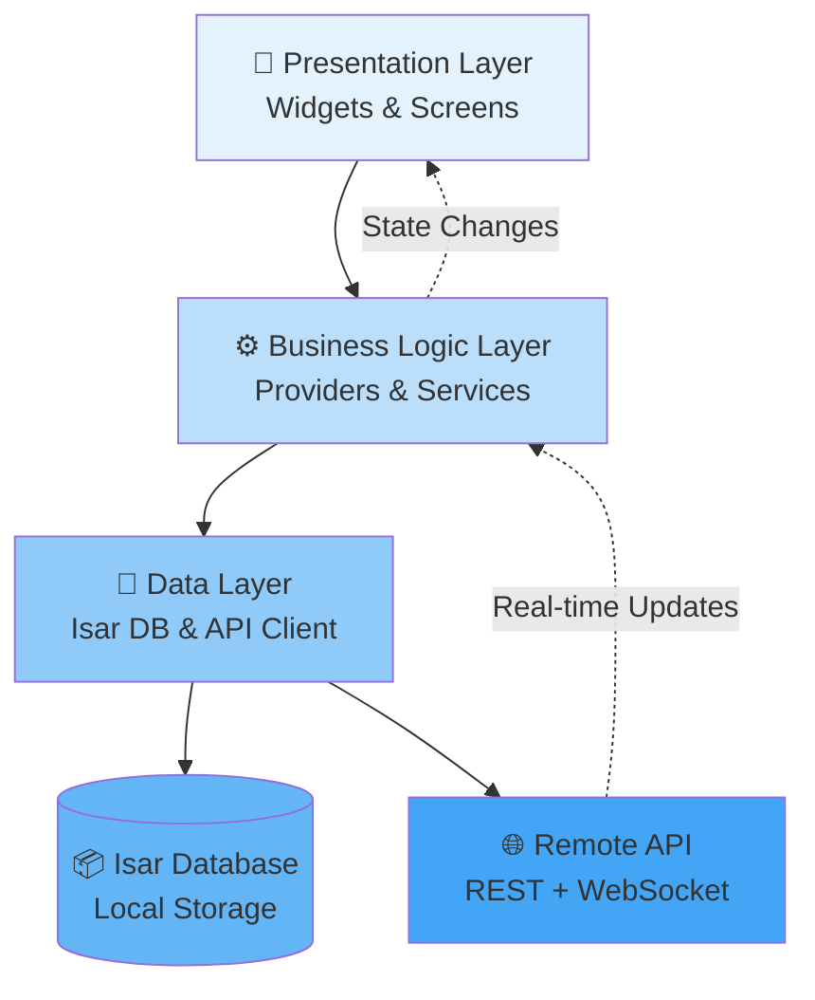

## Overview

The Maneged Flutter app follows a clean, layered architecture pattern:



## Architecture Layers

```
┌─────────────────────────────────────┐
│     Presentation Layer (UI)         │
│  ┌──────────┐  ┌─────────────────┐ │
│  │ Widgets  │  │  State (Provider)│ │
│  └──────────┘  └─────────────────┘ │
└─────────────┬───────────────────────┘
              │
┌─────────────▼───────────────────────┐
│      Business Logic Layer           │
│  ┌──────────┐  ┌─────────────────┐ │
│  │ Services │  │   Use Cases     │ │
│  └──────────┘  └─────────────────┘ │
└─────────────┬───────────────────────┘
              │
┌─────────────▼───────────────────────┐
│         Data Layer                  │
│  ┌──────────┐  ┌─────────────────┐ │
│  │  Isar DB │  │  Appwrite API   │ │
│  └──────────┘  └─────────────────┘ │
└─────────────────────────────────────┘
```

## Core Components

### State Management (Provider)

```dart
class ChatProvider extends ChangeNotifier {
  List<Message> _messages = [];
  
  Future<void> sendMessage(String text) async {
    // Update local state
    _messages.add(Message(text: text));
    notifyListeners();
    
    // Sync to server
    await api.sendMessage(text);
  }
}
```

### Local Database (Isar)

```dart
@collection
class Message {
  Id id = Isar.autoIncrement;
  String? messageId;
  String? text;
  String? senderId;
  DateTime? createdAt;
}
```

### WebSocket Service

```dart
class WebSocketService {
  void connect() {
    _channel = WebSocketChannel.connect(
      Uri.parse('ws://localhost:3000?token=$token'),
    );
    _channel!.stream.listen(_handleMessage);
  }
}
```

## Feature Modules

Each feature is self-contained:

```
features/chat/
├── models/          # Data models
├── screens/         # UI screens
├── widgets/         # Reusable widgets
├── providers/       # State management
└── services/        # Business logic
```

## Data Flow

### Message Sending

```
1. User types message
2. Local Isar DB updated (instant UI update)
3. WebSocket sends to server
4. Server broadcasts to recipients
5. Local DB updated with server confirmation
```

### Real-time Updates

```
1. Server sends WebSocket event
2. WebSocket service receives
3. Local Isar DB updated
4. Provider notifies listeners
5. UI rebuilds automatically
```

## Offline Support

- All data cached locally in Isar
- Queue pending actions
- Auto-retry with exponential backoff
- Sync when connection restored

## Next Steps

<CardGroup cols={2}>
  <Card
    title="Features"
    icon="list"
    href="/mobile/features"
  >
    Explore app features
  </Card>
  <Card
    title="Backend API"
    icon="server"
    href="/backend/introduction"
  >
    Backend integration
  </Card>
</CardGroup>
