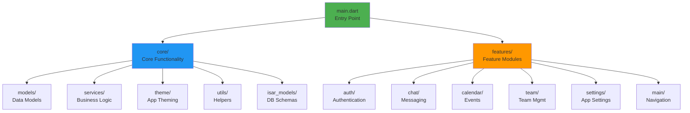

## Overview

The Maneged mobile app is a cross-platform Flutter application that provides team collaboration, real-time messaging, task management, and calendar scheduling. Built with Flutter 3.16+, it offers native performance with a beautiful Material Design 3 interface.

## Key Features

<CardGroup cols={2}>
  <Card title="Real-time Chat" icon="message">
    Individual and group messaging with instant delivery
  </Card>
  <Card title="Offline Support" icon="wifi-slash">
    Full offline functionality with automatic sync
  </Card>
  <Card title="Task Management" icon="list-check">
    Create and track tasks with assignments
  </Card>
  <Card title="Calendar" icon="calendar">
    Schedule events and coordinate teams
  </Card>
</CardGroup>

## Technology Stack

- **Flutter**: 3.16+
- **Dart**: 3.2+
- **State Management**: Provider pattern
- **Local Database**: Isar 3.1+
- **Backend**: Appwrite + Custom Node.js API
- **Push Notifications**: Firebase Cloud Messaging

## Features

### ��� Messaging

- Individual one-on-one chats
- Group conversations with unlimited members
- Message reactions with emojis
- Reply to specific messages (threading)
- File attachments (images, documents, videos)
- Typing indicators
- Read receipts
- Message search

### ��� Team Management

- Create and join organizations
- Role-based permissions (admin, moderator, member)
- Team creation within organizations
- Member management
- Join requests and invitations

### ��� Calendar & Events

- Create and manage events
- Schedule team meetings
- Event reminders
- Calendar views (day, week, month)
- Integration with tasks

### ⚙️ Customization

- Dark/Light themes
- Font size scaling (accessibility)
- Notification preferences
- Profile customization
- Privacy settings

### ��� Platform Support

- Android 5.0+ (API 21+)
- iOS 12.0+
- Planned: Web, Windows, macOS, Linux

## App Architecture



## Screen Flow

```mermaid
graph TB
    Splash[🚀 Splash Screen]
    Auth{Authenticated?}
    SignIn[🔐 Sign In / Sign Up]
    Home[🏠 Home<br/>Chat List]
    
    Splash --> Auth
    Auth -->|No| SignIn
    Auth -->|Yes| Home
    SignIn -->|Success| Home
    
    Home --> Individual[💬 Individual Chat]
    Home --> Group[👥 Group Chat]
    Home --> Calendar[📅 Calendar]
    Home --> Teams[🏢 Teams]
    Home --> Settings[⚙️ Settings]
    
    Individual --> ChatView[Chat View]
    Group --> ChatView
    Teams --> TeamDetail[Team Details]
    Calendar --> EventDetail[Event Details]
    
    style Splash fill:#4CAF50
    style Home fill:#2196F3
    style SignIn fill:#FF9800
```## Data Flow

### Local-First Architecture

1. All data stored locally in Isar database
2. UI reads from local database (instant)
3. Background sync to server
4. Real-time updates via WebSocket
5. Optimistic UI updates

### Sync Strategy

```mermaid
sequenceDiagram
    participant User as 👤 User
    participant UI as UI Layer
    participant Local as Isar DB
    participant Sync as Sync Service
    participant Server as Backend
    
    User->>UI: Performs Action
    UI->>Local: Update Local Data
    Local-->>UI: Instant Feedback ⚡
    
    par Background Sync
        Sync->>Server: Sync to Server
        Server-->>Sync: Confirmation
        Sync->>Local: Update Status
        Local-->>UI: Confirmed ✓
    end
    
    Note over User,Server: Optimistic UI Updates
```

## Next Steps

<CardGroup cols={2}>
  <Card
    title="Installation"
    icon="download"
    href="/mobile/installation"
  >
    Set up the Flutter app
  </Card>
  <Card
    title="Architecture"
    icon="sitemap"
    href="/mobile/architecture"
  >
    Deep dive into app architecture
  </Card>
  <Card
    title="Features Guide"
    icon="book"
    href="/mobile/features"
  >
    Explore all features
  </Card>
  <Card
    title="Backend Integration"
    icon="server"
    href="/backend/introduction"
  >
    Learn about the backend
  </Card>
</CardGroup>
